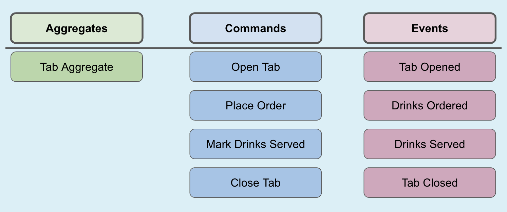
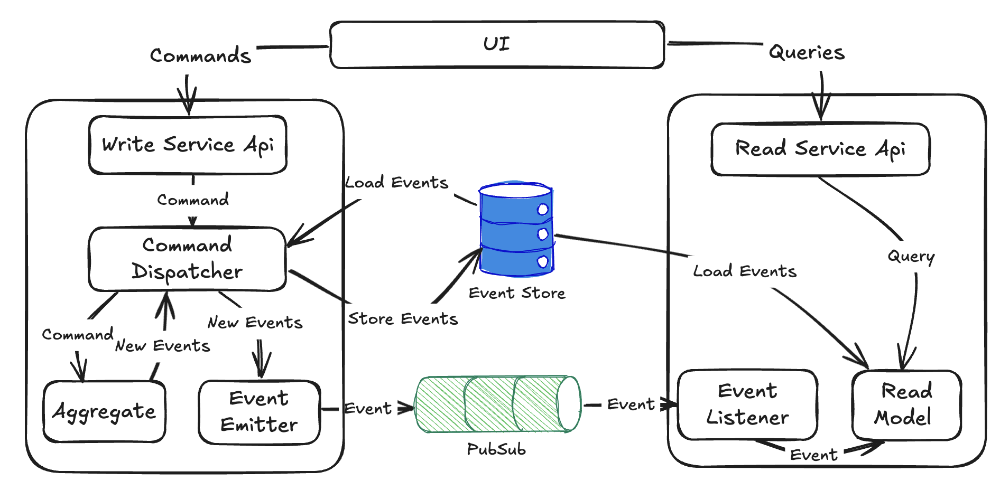
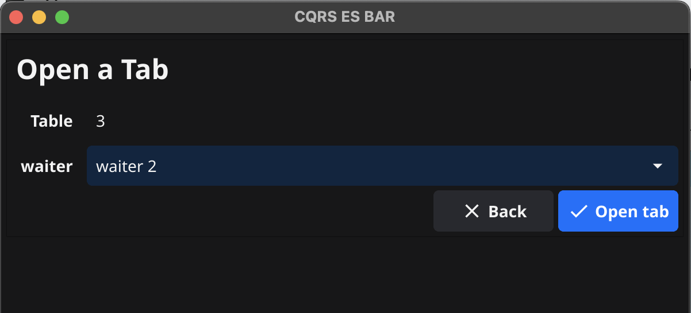
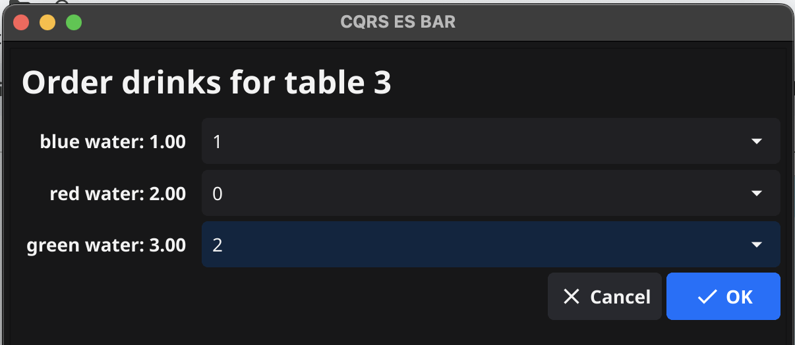
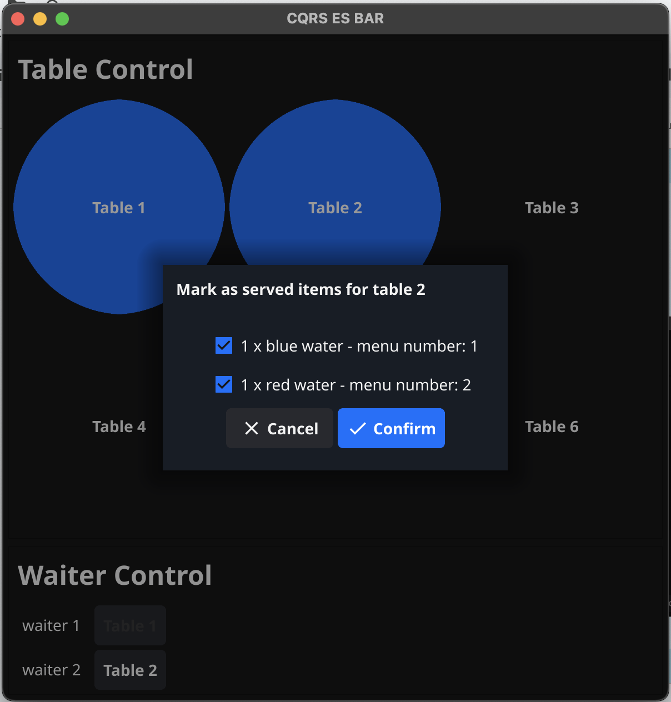
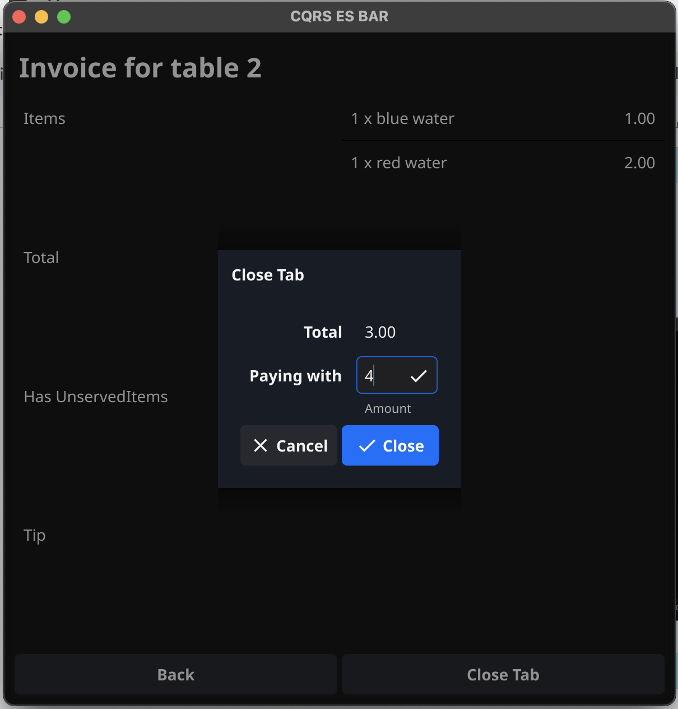
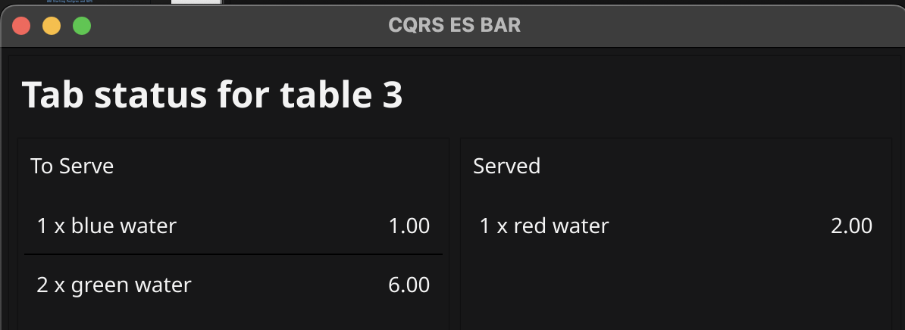

   

# CQRS event sourcing bar
An intentionally over-engineered demo app to showcase CQRS and event sourcing. Heavily inspired by the "Getting started with  CQRS" tutorial from https://cqrs.nu/.

## Design

This repo has just 1 aggregate, the **Tab** aggregate and 4 commands and their counterpart events.



## Architecture

This repo implements a simple UI layer, that sends command requests to the write service, and queries to the read service. 

On each request, the command dispatcher instantiates a new tab aggregate and apply the required past events. when the aggregate is ready it handles the command and produces output events (or an error), which are then stored in the Event Store and emitted via the pubsub interface.

The Event listener on the read service consumes the events and updates the read model that is used to anser the query requests on the read service.

Postgres is used for the Event Store DB and NATS for the PubSub channel.



## Running it locally

The first run you'll need to install all the required dependencies. On an Ubuntu based machine: ```sudo apt-get install golang gcc libgl1-mesa-dev xorg-dev```.

Then install the Golang tools (Golangci-lint, Mockery and Fyne) by running `make tools`.

The build will produce 3 binaries `app`,`readservice` and `writeservice` in the `bin` directory by running `make build`.

### Starting Postgres and NATS

From the repo root directory run `docker compose -f system/docker-compose.yaml up --renew-anon-volumes`

### Starting the API services and the UI app

Simple start from  3 terminals the 3 binaries in order:
```./bin/readservice``` (listens on port 8081)
```./bin/writeservice``` (listens on port 8080)
```./bin/app```

## Screen Captures

### Open Tab



### Place Order



### Mark Drinks Served



### Close Tab



### Tab Status

